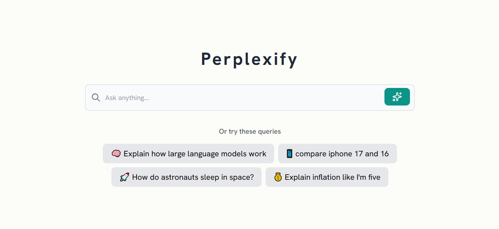

# Perplexify

<p align="center">
   
</p>

Perplexify is a demo search engine inspired by [Perplexity AI](https://www.perplexity.ai/), built to showcase the process of [retrieval-augmented generation (RAG)](https://en.wikipedia.org/wiki/Retrieval-augmented_generation). It uses Google Custom Search Engine (CSE) to fetch relevant webpages for a user query, then extracts and processes their content to generate concise, context-aware answers.

Perplexify retrieves the search results' URLs, fetches and chunks their content, ranks them using [BM25](https://en.wikipedia.org/wiki/Okapi_BM25) and [cosine similarity](https://en.wikipedia.org/wiki/Cosine_similarity), and combines results through Reciprocal Rank Fusion (RRF). The top-ranked chunks are then added to a prompt and used to generate a final, well-informed answer with citations.

This project is purely a demonstration of search retrieval and ranking techniques integrated with large language model prompting — **not** a production-ready application.

## Demo

Here is a demo video of Perplexify in action:

<video src="https://github.com/user-attachments/assets/65c330bf-4a71-4235-81e4-2149789c9f2e" controls></video>

## Prerequisites

Before installation, you'll need to set up the following:

1. **Google Custom Search Engine (CSE):**
   - Go to [Google Programmable Search Engine](https://programmablesearchengine.google.com/)
   - Click "Create a new search engine"
   - Add the sites you want to search (or use "Search the entire web" for broad search).
   - Click "Create"
   - Note your Search Engine ID (found in the "Basic" tab of your control panel)
   - Once created, go to "Sites to exclude" section and add social sites like Youtube, Reddit, X or Facebook to exclude list as these are hard to scrape and the content is not much useful.

2. **Google Cloud API Key:**
   - Go to [Google Cloud Console](https://console.cloud.google.com/)
   - Create a new project or select an existing one
   - Enable the "Custom Search JSON API"
   - Go to "Credentials" and create a new API key
   - Restrict the API key to only work with the Custom Search API

## Installation

### Clone the repository

```bash
git clone https://github.com/frikishaan/perplexify.git
```

### Create virtual environment

```bash
python -m venv venv
```

### Activate virtual environment

```bash
venv\Scripts\activate
```

### Install dependencies

```bash
pip install -r requirements.txt
```

### Set environment variables

```bash
cp .env.example .env
```

Update the `.env` file with your credentials and configurations.

1. **GOOGLE_API_KEY** - Your Google Cloud API Key
2. **GOOGLE_CSE_ID** - Your Google Custom Search Engine ID
3. **TOP_RESOURCES_TO_READ** - The number of resources to read from the search results
4. **TOP_K_CHUNKS** - The number of chunks to read from each resource (this affects the prompt length for LLM)
5. **MAX_TOKEN_PER_CHUNK** - The maximum number of tokens per chunk (this affects the prompt length for LLM)
6. **USE_COSINE_SIMILARITY** - A boolean value to enable cosine similarity (this may increase the response time).
7. **EMBEDDING_MODEL** - The embedding model to use
8. **EMBEDDING_DIMENSIONS** - The embedding dimensions (higher dimensions may increase the response time).
9. **TEXT_GENERATION_MODEL** - The text generation model to use (like gemma3:4b).

### Run the application

```bash
uvicorn main:app --reload
```

### Access the application

Open your browser and navigate to `http://localhost:8000`.

Note: Make sure the Ollama instance is running.

## The Process

The search in **Perplexify** is powered by the Google Custom Search API.

1. **Query Submission:** When a user submits a query, the app sends a request to the Google Custom Search API to retrieve relevant search results.
2. **Content Extraction:** The URLs from the search results are fetched, and their content is extracted with proper error handling and timeouts.
3. **Chunking:** Extracted content is split into smaller, meaningful chunks using [spaCy](https://spacy.io/), ensuring that sentences are not split mid-way and that each chunk preserves coherent context for better relevance and ranking.
4. **Ranking:** Chunks are ranked using **BM25**. Optionally, you can enable **cosine similarity** in the `.env` file to rank chunks based on embedding similarity. The purpose of ranking is to select only the top chunks—rather than the entire extracted content—for the LLM context, which has limited capacity.
5. **Fusion:** If both BM25 and cosine similarity are used, **Reciprocal Rank Fusion (RRF)** combines the rankings to prioritize the most relevant chunks.
6. **Answer Generation:** The top-ranked chunks are added to the prompt for LLM to generate a final, context-aware answer.

This workflow demonstrates a simplified **Retrieval-Augmented Generation (RAG)** process, integrating document retrieval and ranking with language model generation.

> **Note**: The quality of the generated answers and citations depends on the language model you use. For best results, you can try Ollama cloud free models such as `gpt-oss:20b-cloud`. For local setups, using models with at least 3–4B parameters is recommended.

## License

[MIT License](/LICENSE)
